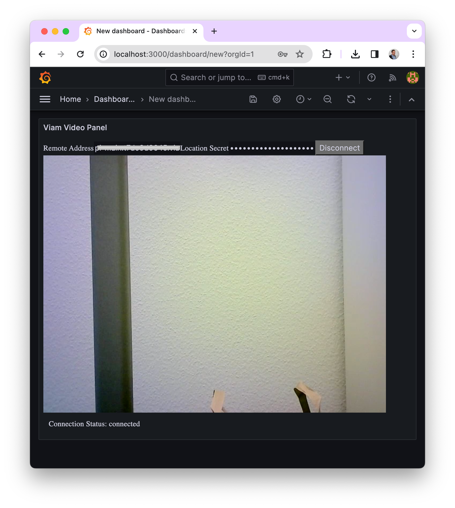

# Viam Grafana Video Panel

This repo contains a simple Grafana panel allowing you to add a Viam camera stream to a Grafana dashboard. This is no production ready code but might be a good starter. Feel free to provide feedback and also happy to get pull requests for extensions and general improvements.

## Preparation

The camera name is currently hardcoded in "SimplePanel.tsx" line 35. Change it from "camera" to your camera name or even easier, change the name of your camera through app.viam.com to "camera"

## Installation

Download the zip file from a release and unzip it into your Grafana "plugins" folder. If you don't know where to find it have a look at "Administration/Settings" in your Grafana instance as shown on the screenshot below.

## Configuration

Once the plugin is installed, you might have to restart the Grafana service. You can then simply add the video panel as shown on the screenshots below:

